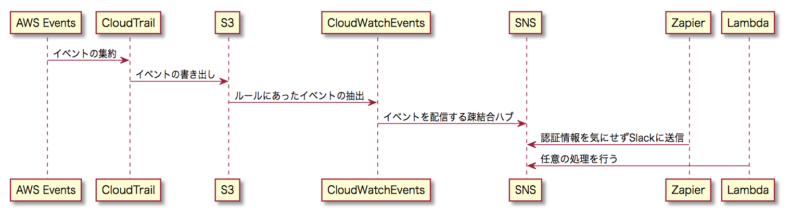

## Terraform.Aws

Teamplates for AWS Terraform.

## Gettting Started

### Before begin

* Create your Terraform IAM User at AWS IAM User.
* Get AccessKey/AccessSecret and set it as a Profile, or run terraform at EC2 Profiled Instance.
* Modify Profile at terraform.tf, remote_state.tf, main.tf
* Modify cloudtrail.tf as you like.

### Run Terraform

* terraform plan
* terraform apply

### Destrpy if needed

* terraform destroy

## TODO 

- [x] CloudTrail
    - OneStop creation.
- [x] Console Login Event
- [ ] IAM
- [ ] S3
- [ ] Billing Alert

## Flow

### Console Login Event

